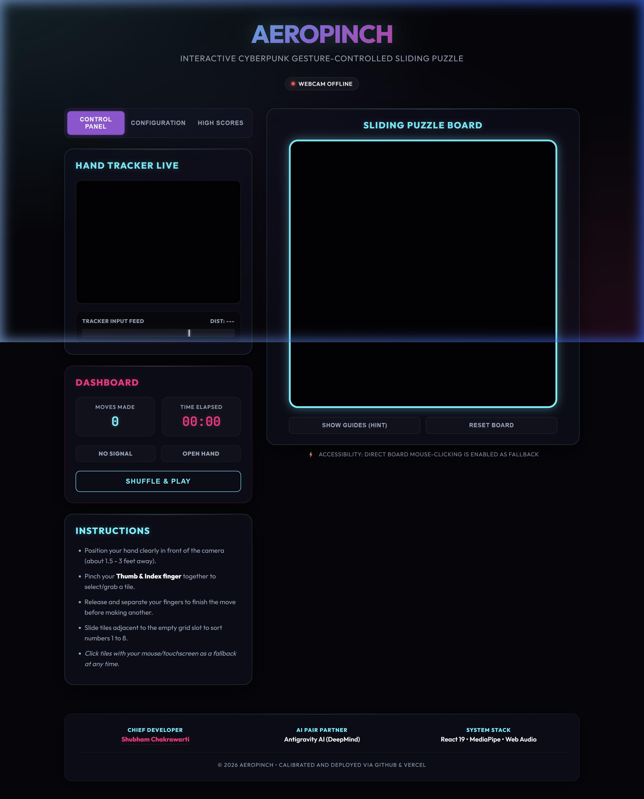

# ⚡ AeroPinch | Cyberpunk Gesture-Controlled Jigsaw Puzzle

AeroPinch is a state-of-the-art interactive jigsaw puzzle controlled entirely by webcam hand gestures. Built with React and MediaPipe, it features dynamic difficulties, 8-bit sound effects synthesized on-the-fly, canvas-based particle physics, and a hardware gesture monitor.

👉 **Play Deployed Live Site**: [webcam-puzzle-six.vercel.app](https://webcam-puzzle-six.vercel.app)

---

## 📸 Interface Preview



---

## 🚀 Key Features

* **Select-and-Swap Jigsaw Mode**: Fluid drag-and-drop gameplay. Click-hold or pinch a tile to pick it up, drag it floating over the grid (with 3D shadows and scale-lift animations), and drop to swap values.
* **Aspect Ratio Center-Cropping**: Automatically crops webcam streams and presets to a perfect square, correcting proportions and removing vertical stretching.
* **Procedural Sound Synth (Web Audio API)**: Procedures 8-bit sound effects (Pinch Grab, Pinch Release, Slide Swap, and a C-major Victory melody) natively inside the browser context without static files.
* **Multi-Difficulty Grid Scaling ($3\times3$, $4\times4$, $5\times5$)**: Display size is upscaled to $600\text{px}$ which aligns perfectly with all grid sizes without pixel truncation.
* **Hardware Calibration HUD**: Real-time graph monitoring index-thumb distance against the gesture threshold. Directly updates DOM nodes in the frame loop, bypassing React render overhead for zero input latency.
* **VFX Particle Sprites**: Canvas particles blast on tile swaps and victory solve events, with trailing glow cursors following hand movements.

---

## 🛠️ Tech Stack
* **Framework**: React 19 (Hooks, Refs, state context synchronizers)
* **Build System**: Vite
* **Gesture Tracking**: MediaPipe Hands & Camera Utils
* **Audio Synthesis**: Native Web Audio API
* **Graphics Layout**: Custom Vanilla CSS (Dark Cyberpunk Glassmorphic theme)
* **CI/CD Host**: Vercel & GitHub Actions

---

## 💻 Local Setup & Development

To run this project locally:

1. **Clone the repository**:
   ```bash
   git clone https://github.com/shubha9696/webcam-puzzle.git
   cd webcam-puzzle
   ```
2. **Install node dependencies**:
   ```bash
   npm install
   ```
3. **Boot the Vite hot-reloading dev server**:
   ```bash
   npm run dev
   ```
4. **Navigate to localhost**:
   Open [http://localhost:5173](http://localhost:5173) in your browser. (Make sure you allow webcam permissions for gesture tracking!).

---

## 👥 Credits

* **Lead Architect**: [Shubham Chakrawarti](https://github.com/shubha9696)
* **Pair Programming Partner**: Antigravity AI (Google DeepMind)
* **Hosting Platform**: Deployed and aliased via [Vercel](https://vercel.com)
